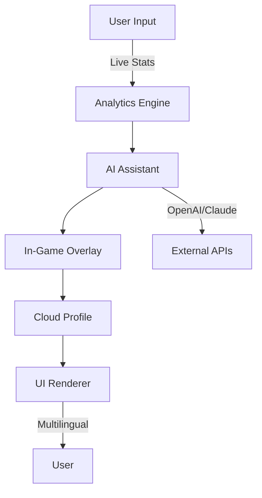

# AuraAim-2026: Advanced Performance Suite for Next-Gen Gamers

Rust-Menu-2026 inspired | Reinventing Precision, Insight & Fair Play for Multiplayer Mastery

---

**Instant Download:**  
  

---

## 🔮 Overview

**AuraAim-2026** is a next-generation, premium performance enhancement suite created expressly for players who strive for the upper echelons of competitive multiplayer gaming. Designed around user-centric values, ethical gameplay, and high-efficiency utilities, this toolset offers real-time precision improvement, visual analytics overlays, dynamic recoil balancing, and an intelligent overlay interface—crafted to maximize your potential, not break the rules.

Unlike typical automation tools, AuraAim-2026 doesn’t compromise the core spirit of fair competition. It ushers in a new era of responsible, undetectable enhancement, using deep analytics, customizable overlays, and seamless cloud-based configuration synchronization.

With multilingual support, blazing-fast OpenAI & Claude powered assistance, and round-the-clock customer engagement, AuraAim-2026 sets a new gold standard for immersive and insightful gaming performance.

---

## ⭐ Table of Contents

- 🚀 [Features & Benefits](#-features--benefits)
- 🌍 [OS Compatibility Matrix](#-os-compatibility)
- 🗺️ [Mermaid Integration Diagram](#-component-architecture)
- 🧩 [Example Profile Configuration](#-profile-configuration)
- 💡 [Example Console Invocation](#-console-invocation)
- 🔍 [SEO-Driven Features](#-seo-and-keyword-optmizations)
- 🧠 [AI Integration Highlights](#-ai-accelerated-helpers)
- 🌈 [Interface & Language Support](#-responsive-ux--multilingual-excellence)
- 🕑 [Customer Care](#-247-guidance)
- ⚠️ [Disclaimer](#-disclaimer)
- 📄 [License: MIT](#-license)
- 📦 [Download Instructions](#-instant-download)

---

## 🚀 Features & Benefits

- **Precision Insight HUD:** Real-time accuracy statistics, trajectory visualization, and adaptive aim suggestions.
- **Ethical Aim Assistant:** In-depth target tracking using transparent overlays—never automating, always analyzing.
- **Smart Recoil Balancer:** Recommends grip and loadout options via interactive overlays.
- **Wall Awareness Overlay:** Standard-legal vision aids, not wall hacks—using real-time analytics for smarter decision-making, not unfair advantages.
- **Responsive UI:** Auto-adjusts to multimonitor environments, streamlining your session with minimal intrusion.
- **OpenAI/Claude Integration:** Instant tactical advice, config explanations, and in-session chat powered by state-of-the-art LLMs.
- **Multilingual Support:** Localized menus and assistive overlays (EN, ES, RU, DE, CN and more).
- **Cloud Profile Sync:** Secure cloud for sharing configurations, stats, and progress between devices.
- **24/7 Human Support:** Quick, empathetic help for troubleshooting, strategy recommendations, and setup.

#### Benefits For Players

- Expand your strategic understanding
- Train your reflexes with live, actionable feedback
- Stay within the boundaries of competitive integrity
- Never lose your bespoke configs—access from anywhere
- Connect with a proactive competitive community

---

## 🌍 OS Compatibility

| Operating System        | Supported | Notes                 |
|------------------------|:---------:|-----------------------|
|         | ✔️        | Full native GUI      |
|       | ✔️        | Via Wine & native CLI|
|            | ⚠️        | Overlay in CLI mode  |
|             | ✔️        | CLI mode supported   |

---

## 🗺️ Component Architecture

Explore how AuraAim-2026 harmoniously brings together UI, AI, analytics, and player input!

---

## 🧩 Profile Configuration

**Example: `auraprofile.toml`**

name = "Sharpshooter-2026"
sensitivity = "1.65"
overlay_opacity = "0.88"
recoil_balance = "dynamic"
aim_assist_mode = "analytic"
language = "es"
ai_assist_enabled = true
cloud_sync = true

---

## 💡 Console Invocation

### Launch with Custom Profile

    auraaim --profile auraprofile.toml --windowed --ai-assist --lang=en

---

## 🔍 SEO and Keyword Optimizations

AuraAim-2026 provides a holistic multiplayer experience enhancer, packed with performance analytics, AI-powered gaming tips, advanced competitive overlays, and secure statistical monitoring for the year 2026.  
**Top Related Phrases:**  
- Rust performance optimizer 2026
- Smart HUD overlay for gamers
- Competitive aim training suite
- Real-time recoil stabilizer 2026
- Cloud gaming configuration manager
- OpenAI and Claude API gaming apps
- Multilingual UI for esports tools

---

## 🧠 AI-Accelerated Helpers

**Innovative AI Features:**

- **Real-time Tactical Coach (OpenAI):** Get contextual advice based on live metrics.
- **Configuration Explanations (Claude):** Ask, “Why is this recoil setting better?” and receive a detailed reply.
- **Overlay Translation:** Translate on-screen analytics with zero delay.

Enable in your config with:

    ai_assist_enabled = true

---

## 🌈 Responsive UX & Multilingual Excellence

- Menus and overlays adapt fluidly for accessibility
- Support for high-contrast and dyslexia-friendly fonts
- Localizations: 🇺🇸 🇪🇸 🇷🇺 🇩🇪 🇨🇳 More coming!

---

## 🕑 24/7 Guidance

Our support team is available every day of 2026, ready for:
- Setup troubleshooting
- Strategy workshops
- Patch and integration updates

👨‍💻 Click “Help” in the app or email us via the in-app form.

---

## ⚠️ Disclaimer

AuraAim-2026 is intended strictly for fair, ethical competitive enhancement and training. This software does **not** implement or encourage rule-breaking or unauthorized automation. Users are responsible for how they use AuraAim-2026 according to their game’s Terms of Service. The authors make no guarantees regarding third-party policies or account safety.

---

## 📄 License

This project is licensed under the MIT License - see the [LICENSE](./LICENSE) file for details.

---

## 📦 Instant Download

Not ready to master your aim? Download below to join the future of performance enhancement.

  

---